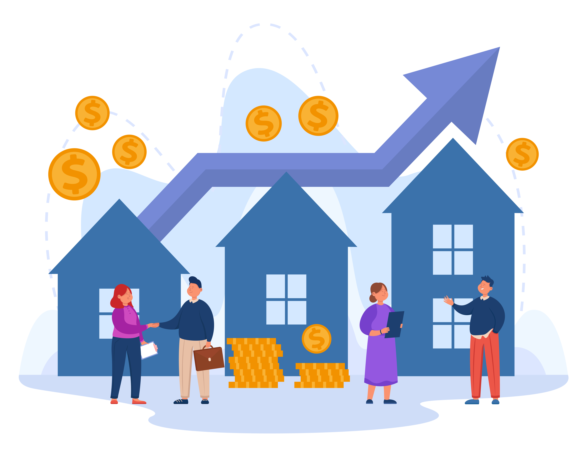
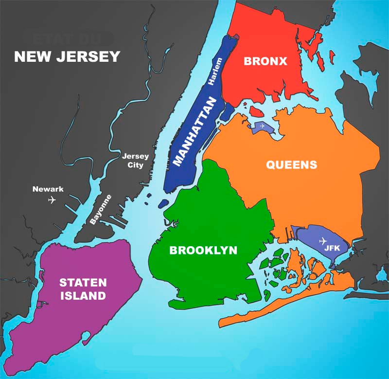
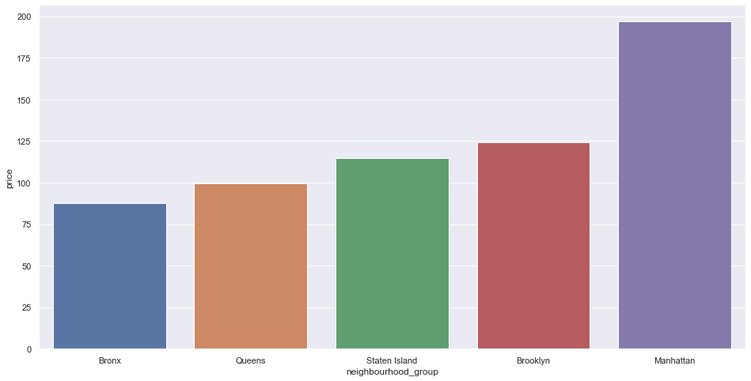
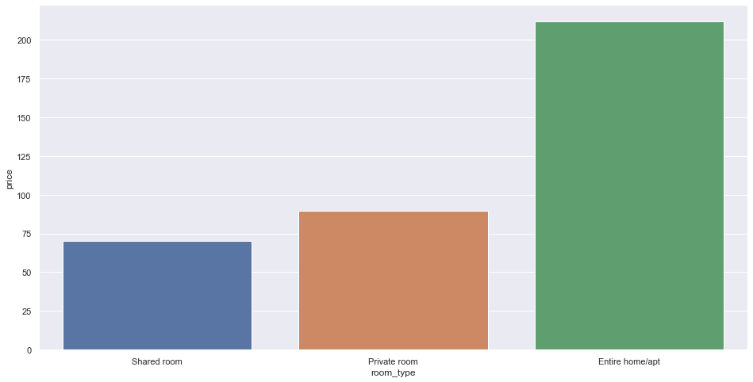
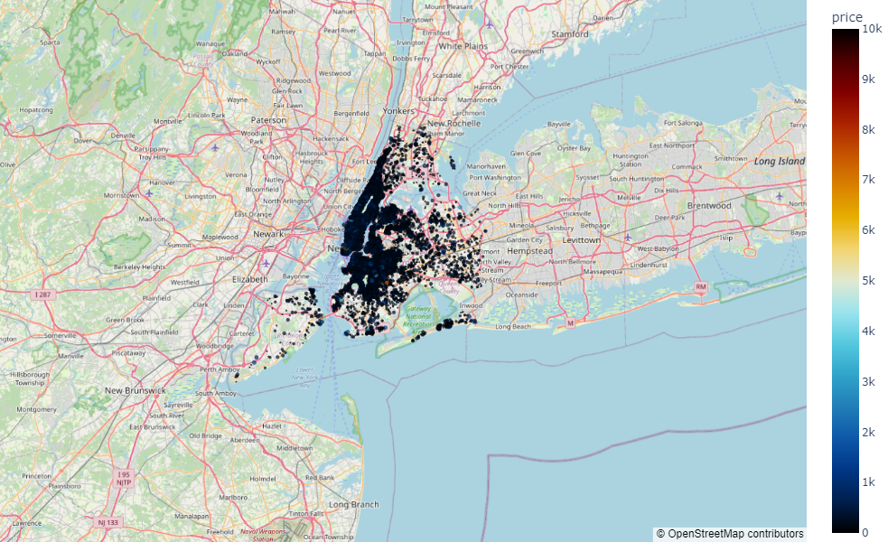

# Aluguel de Imóveis - Airbnb
  

# Problema de Negócio:

O investidor James Bauer, gostaria de diversificar seus negócios e começar a investir em imóveis. Ele definiu que compraria imóveis na cidade de Nova York, nos Estados Unidos. Por ser um dos lugares mais caros para se morar no país, ele acredita que obterá um retorno satisfatório de seus investimentos se alugar imóveis na cidade. Como todas as suas decisões são baseadas em dados, ele quer que alguém o ajude nessa empreitada.

Ele inicialmente planeja arrendar os imóveis adquiridos e por isso definiu que usará a plataforma Airbnb para esse fim. Ele encontrou um conjunto de dados na internet contendo dados sobre o comportamento dos anfitriões e suas propriedades na cidade de Nova York.

Ele quer ajuda para descobrir as regiões com os aluguéis mais altos e os preços mais altos e quais apartamentos ou casas estão em regiões favoráveis da cidade de Nova York. Ele acredita que essas características o ajudarão a recuperar mais rapidamente o dinheiro investido na aquisição de alguns imóveis. O desafio é fazer uma análise exploratória e responder as perguntas do CEO.

## I. Atributos

<table style="width:100%">
<tr><th>Atributos</th><th>Descrição</th></tr>
<tr><td>id</td><td>ID exclusivo para cada imóvel</td></tr>
<tr><td>host_id</td><td>id do host de cada imóvel</td></tr>
<tr><td>host_name</td><td>nome do host</td></tr>
<tr><td>neighbourhood_group</td><td>nome do bairro que o imóvel está localizado</td></tr>
<tr><td>neighbourhood</td><td>nome do subúrbio que o imóvel está localizado</td></tr>
<tr><td>latitude</td><td>latitude do imóvel</td></tr>
<tr><td>longitude</td><td>longitude do imóvel</td></tr>
<tr><td>room_type</td><td>tipo de imóvel à ser alugado, podendo ser a casa/apto completo, quarto privado ou quarto compartilhado</td></tr>
<tr><td>price</td><td>valor do aluguel</td></tr>
<tr><td>minimum_nights</td><td>quantidade mínima de noites que alguém pode alugar o imóvel</td></tr>
<tr><td>number_of_reviews</td><td>número de avaliações que um imóvel recebe</td></tr>
<tr><td>last_review</td><td>data na qual o imóvel recebeu a última avaliação</td></tr>
<tr><td>reviews_per_month</td><td>quantidade de avaliações que o imóvel recebe por mês</td></tr>
<tr><td>calculated_host_listings_count</td><td>número de imóveis que um host é responsável</td></tr>
<tr><td>availability_365</td><td>número de dias que o imóvel está disponível para ser alugado no ano</td></tr>
</table>

## Bairros de Nova York

# Premissas de Negócio:

* Todos os imóveis estão disponíveis desde a data da última avaliação.
* As linhas com valores NA na coluna 'last_review' representam propriedades que nunca foram alugadas ou avaliadas.

# Estratégia de Negócio:

Etapa 01 - Entedimento do problema de négocio.

Etapa 02 - Download do dataset diretamente do <a href="https://www.kaggle.com/datasets/dgomonov/new-york-city-airbnb-open-data" target="_blank">Kaggle</a>.

Etapa 03 - Limpeza e análise do conjunto de dados.

Etapa 04 - Exploração os dados (EDA) para criar hipóteses, gerar insights e validá-los.

Etapa 05 - Responder as perguntas do CEO.

# Insights:

Hipótese 1 - Os aluguéis mais caros em média da cidade de Nova York está na região de Manhattan.

A hipótese é verdadeira. Aluguéis na região de Manhattan, são em média, 8.34% mais caros que as demais.

Hipótese 2 - Os aluguéis de imóveis do tipo completo são em média 15% mais caros que os demais.

A hipótese é verdadeira. Imóveis do tipo completo, são em média, 28.03% mais caros que os demais.

# Resultados: 

Os imóveis ativos que possuem pelo menos uma avaliação e a melhor rentabilidade estão descritos na tabela abaixo de acordo com o bairro:

|      __Bairro__       |   __Rentabilidade__  |
| --------------------- | ---------------------| 
|       Midtown         |    US$ 310.182.01    |
|    Upper East Side    |    US$ 239.673.70    | 
|       Harlem          |    US$ 194.435.50    |
|    Upper West Side    |    US$ 191.731.30    |

***Rentabilidade: indica o grau de sucesso de determinado investimento, calculado a partir do percentual de remuneração do capital investido na atividade.***

# Conclusões:

As perguntas do CEO que motivaram este projeto foram respondidas. Com base nos dados, o CEO poderá dar novos passos no mercado imobiliário.

# Melhorias Futuras

* Criação de mais insights.
* Criar um app de visualização dos imóveis por região e sua densidade de preços.
* Desenvolver um modelo de machine learning para prever o preço de uma propriedade.

